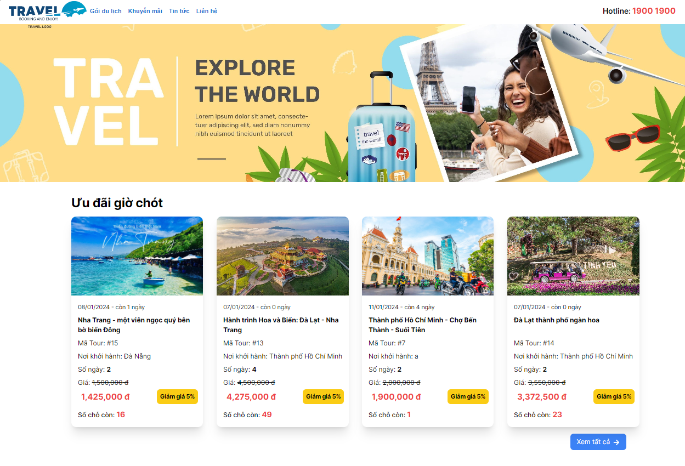
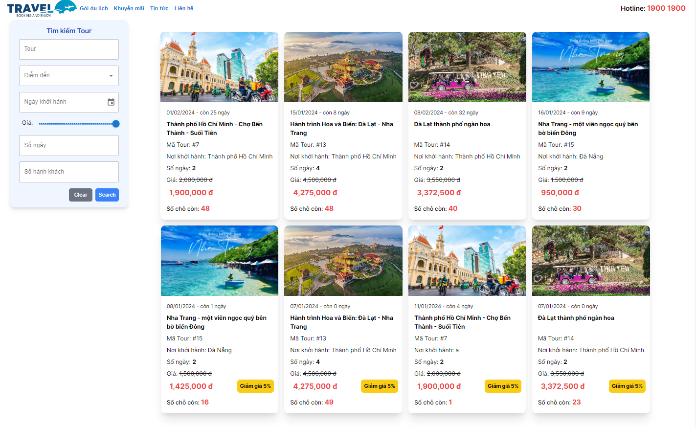
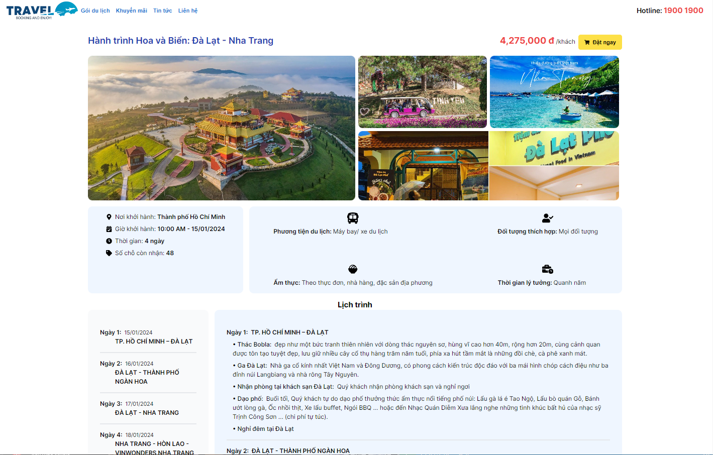
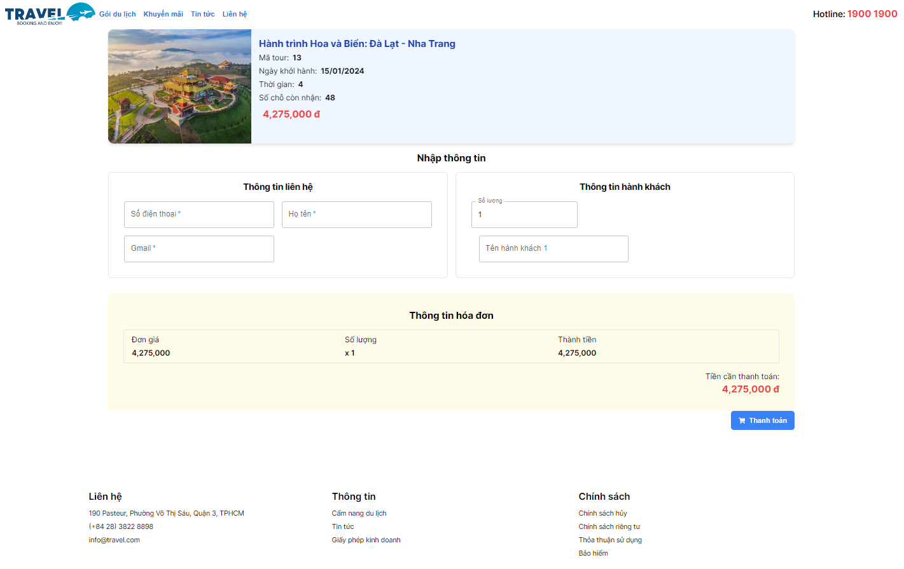

# Customer Side

## Overview

Welcome to the Customer Side module of our web application! This section is dedicated to providing a seamless and enjoyable experience for our customers. Customers can explore available tours, make bookings, view their booking history, and manage their profiles with ease.

## Features

- **Tour Exploration:** Browse through a diverse range of available tours with detailed information about destinations, durations, prices, and highlights.

- **User Authentication:** Secure and hassle-free user authentication for a personalized experience.

- **Booking Process:** Easily book tours by providing necessary details, selecting dates, and completing the payment process.

- **Booking History:** View and manage booking history, including details about past and upcoming tours.

- **User Profile:** Create and manage user profiles, update personal information, and customize preferences.

- **Notifications:** Receive timely notifications about booking confirmations, updates, and special offers.

## Technologies Used

- **Frontend:**
  - HTML5, CSS3, JavaScript
  - Framework React
  - UI Library TailwindCSS, Material-UI

- **Backend:**
  - Server-side language Node.js
  - Web framework ExpressJS
  - Database MySQL

## User Interface

